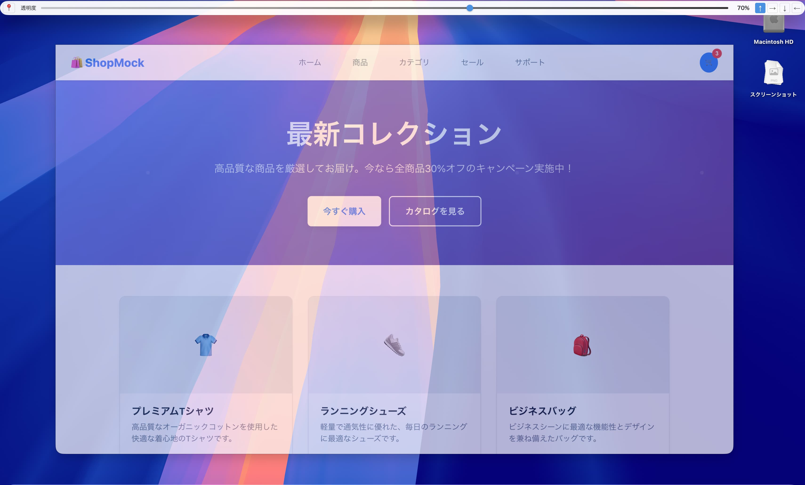
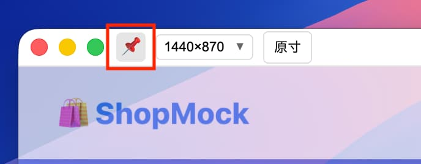

MockLay v0.2.0 Alpha - 公開リリース アップデート情報

このリリースは、新機能の追加と修正を含みます。  
アップデートは下記リンクからダウンロードできます。  
https://github.com/adenohitu/mocklay-releases/releases  

## 新機能の追加
### フロートモードの追加

フロートモードは、ウィンドウを常に最前面表示するモードです。  
画像を開いた後、ウィンドウの右上にある「📌」のボタンを押すと有効になります。 

このモードの時、ディスプレイ最上面に透過画像ウィンドウが固定されます。

このモード自体はテスト的な導入なので、不具合や未完成な部分が多く含まれます。  
ご意見や要望は、ぜひお寄せください。  

## 修正内容

### ウィンドウサイズ変更時の調整  
ウィンドウサイズを変更した時、強制的に初期位置に戻されてししまう問題を修正しました。  
ウィンドウの左上の位置がウィンドウサイズを変更しても維持されるようになりました。  
複数ディスプレイ時の動作にも影響します。

### デフォルトの透過度を70%に修正  
今後のアップデートで、設定機能が追加され、この値についてもユーザー側で調整できるようになる予定です。  
透過度の数値指定や、透過度の調整方法についても今後のアップデートで改善する予定です。

### ウィンドウサイズが小さい時のツールバーの修正
ウィンドウサイズが650px以下の挙動について、使いやすいように調整しました。

### ツールバーの変更
デバイスの選択と、数値でのウィンドウサイズ設定ボタンを統合しました。  
デバイス一覧に、ChromeのDevtoolにあるような一般的なサイズの選択肢を追加しました。

### アプリ名が「mocklay」から「MockLay」に変更されました。
内部的なアプリIDはmocklayから変更ありませんが、ダウンロード時のファイル名や表示される際の表記が変更されました。

### ツールバーが透過しないように修正
ツールバーが透過されないようになり、画像部分のみが透過するようになりました。

### その他パフォーマンス修正
快適に利用するためのアップデートを行いました。