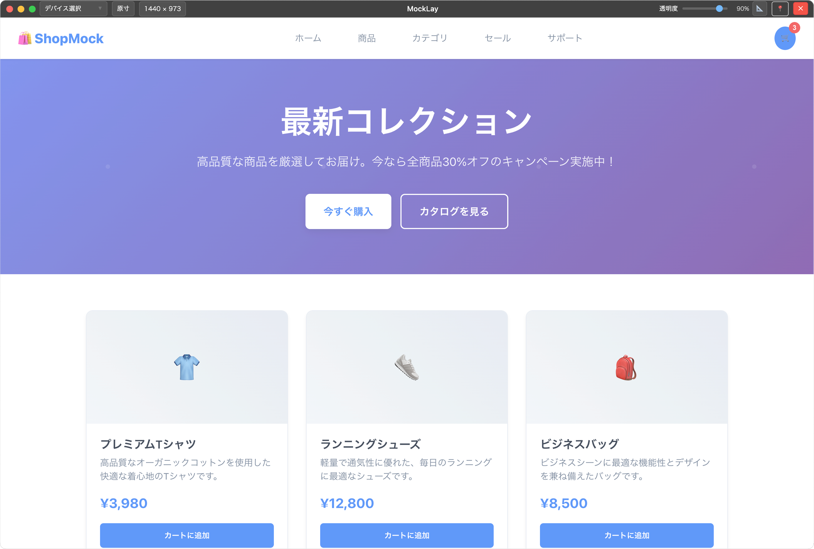

# MockLay

MockLay は、デザインの校正・チェック作業をサポートするアプリケーションです。画像を半透明のオーバーレイとして表示し、ブラウザやアプリ上のコンテンツと比較しながらデザインの確認を行うことができます。



## 主な機能

### 📸 画像オーバーレイ表示

- 画像をドラッグ&ドロップで簡単に読み込み
- 半透明表示でブラウザ画面やデバッグ画面と重ねて比較
- 透明度の調整（20%〜100%）

### 🔧 表示制御

- **ウィンドウサイズ調整**: 手動でのサイズ変更に対応
- **スケール調整**: 画像の拡大・縮小
- **配置調整**: 画像の位置を細かく調整（9 つのアンカーポイント + オフセット）
- **元サイズ復元**: ワンクリックで画像の元サイズに戻す

### 📜 履歴機能

- 最近使用した画像の履歴を保存
- 履歴から素早く画像を再読み込み

### 🎯 ウィンドウ制御

- 常に最前面表示
- 画像なしの状態ではウィンドウ位置固定
- タイトルバーの最小化・閉じるボタン

## システム要件

- **OS**: macOS, Windows

## インストール

### ⚠️ 重要な注意事項

#### Alpha 版に関する警告

- **このソフトウェアは Alpha 版（開発初期段階）です**
- 予期しないクラッシュやデータ損失が発生する可能性があります
- すべての機能が正常に動作することを保証いたしません
- 重要なデータを扱う作業環境などでの使用はお控えください

#### コード署名について

- このアプリケーション Alpha 版（開発初期段階）であり、**コード署名されていません**
- macOS では、Gatekeeper を回避しなければ実行できません
- Windows では「Windows Defender SmartScreen」が警告を表示する場合があります
- これらの警告は、署名されていないアプリケーションに対する正常なセキュリティ機能です

### インストール方法

下記 Assets から対応するファイルをダウンロード  
https://github.com/adenohitu/mocklay-releases/releases/tag/v0.1.7

- macOS(Apple silicon のみの対応): `mocklay-0.1.7-arm64.dmg`
- Windows: `mocklay-0.1.7.Setup.exe`

<details>
<summary>署名なしのアプリを開く方法(Mac)</summary>

セキュリティ機能を回避してインストールする方法なので注意してください
アプリをコピーしたのち、ターミナルで下記コマンドを実行します

```sh
xattr -rc /Applications/mocklay.app
```

</details>

### 免責事項

**このソフトウェアは「現状のまま」提供されます。開発者は以下について一切の責任を負いません：**

- ソフトウェアの使用によって生じるいかなる損害（データ損失、システム障害、作業の中断等を含む）
- ソフトウェアの動作不良、バグ、セキュリティ脆弱性
- 第三者の権利侵害
- 使用者のシステム環境での互換性問題
- その他、直接的・間接的・特別・偶発的・結果的損害

**使用者の責任において、自己のリスクでご利用ください。**
